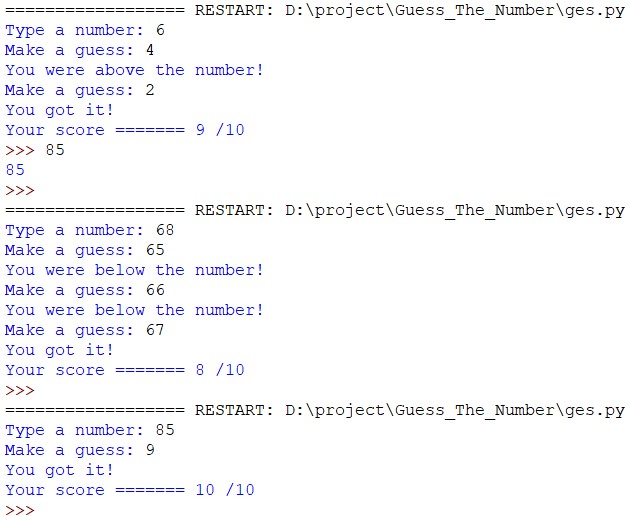

# Guess The Number

This  is a gaming application
where you need to select an range to guess a number with in it which was generated by system based on the performance (uses chances) It returns yours score.
## Source Code  
```python
import random
top_of_range = input("Type a number: ")

if top_of_range.isdigit():
    top_of_range = int(top_of_range)

    if top_of_range <= 0:
        print('Please type a number larger than 0 next time.')
        quit()
else:
    print('Please type a number next time.')
    quit()
random_number = random.randint(0, top_of_range)
guesses = 11

while (guesses):
    guesses -= 1
    user_guess = input("Make a guess: ")
    if user_guess.isdigit():
        user_guess = int(user_guess)
    
    else:
        print('Please type a number next time.')
        continue

    if user_guess == random_number:
        print("You got it!")
        break
    elif user_guess > random_number:
        print("You were above the number!")
    else:
        print("You were below the number!")
if(guesses==0):
    print("you didn't get it..! Better luck next time")
else:
    print("Your score =======", guesses,"/10")

```




